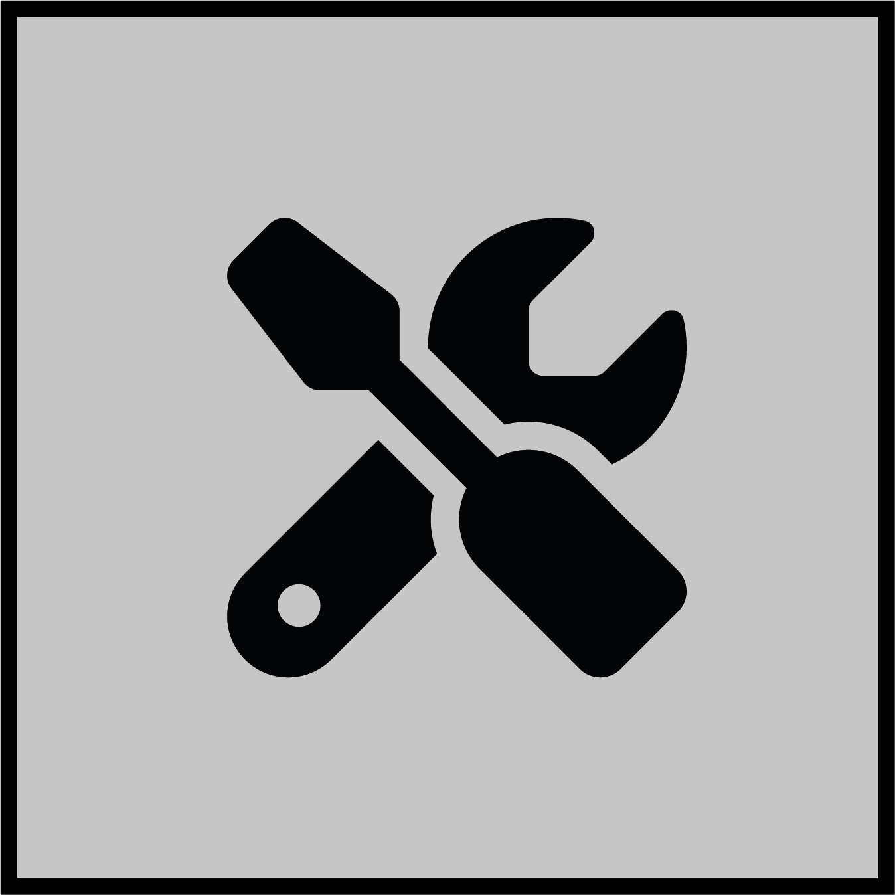

[](./LICENSE)
[](https://github.com/davidmeijer)
[](https://shields.io/)

# MolTools



MolTools is a web-based toolbelt for visualizing and analyzing natural product compounds.

Visit the MolTools toolbelt [here](https://moltools.bioinformatics.nl/).

## Run locally for development

### Server

Create a local environment with conda and install server side dependencies with pip from `src/server/requirements.txt`:

```bash
conda create -n moltools python=3.10
conda activate moltools
pip install -r src/server/requirements.txt
```

### Client

First install NPM package manager and Node.js on your device.

Then install client side dependencies with NPM from `src/client/package.json`:

```bash
cd src/client
npm install
```

### Run

Run the server in one terminal:

```bash
python3 ./app/server/api.py
```

Run the client in another terminal:

```bash
cd src/client
npm start
```

Visit `http://localhost:3000/` to view the app.

## Run with Docker

Run the following script to build and run the app in Docker:

```bash
run_docker.sh <api_port> <client_port> -d
```

The app will be available at `http://localhost:<client_port>/`.

### Rebuild Docker image

Run the following script to rebuild the Docker image:

```bash
SERVER_PORT=<server_port> CLIENT_PORT=<client_port> BROWSER_PORT=<browser_port> DATABASE_PORT=<database_port> docker-compose build
```